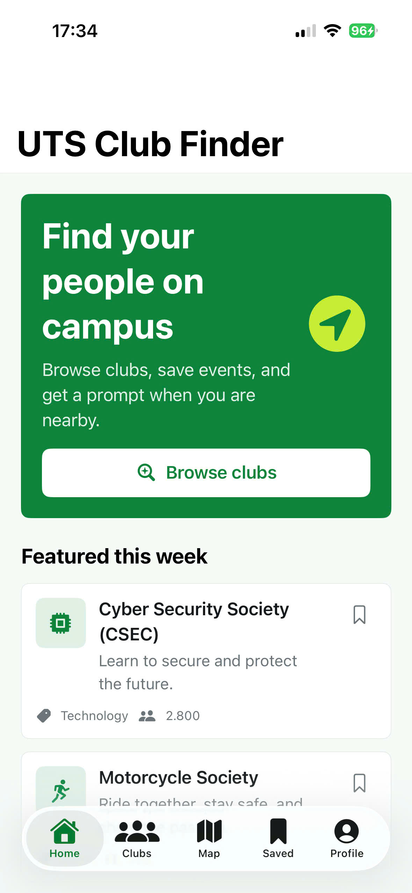
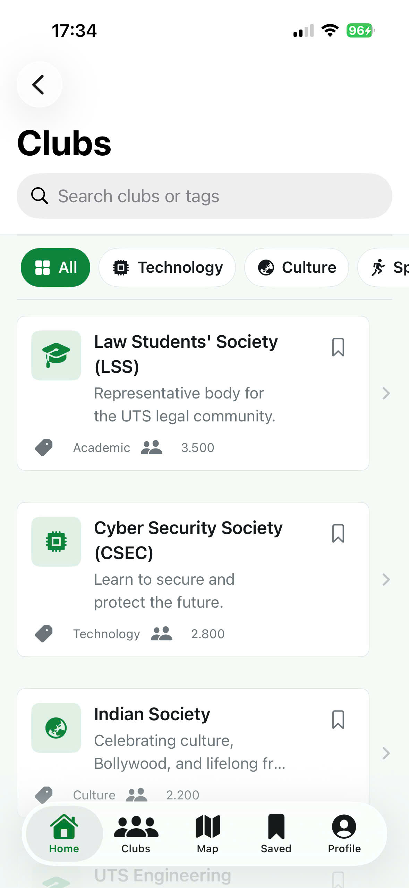
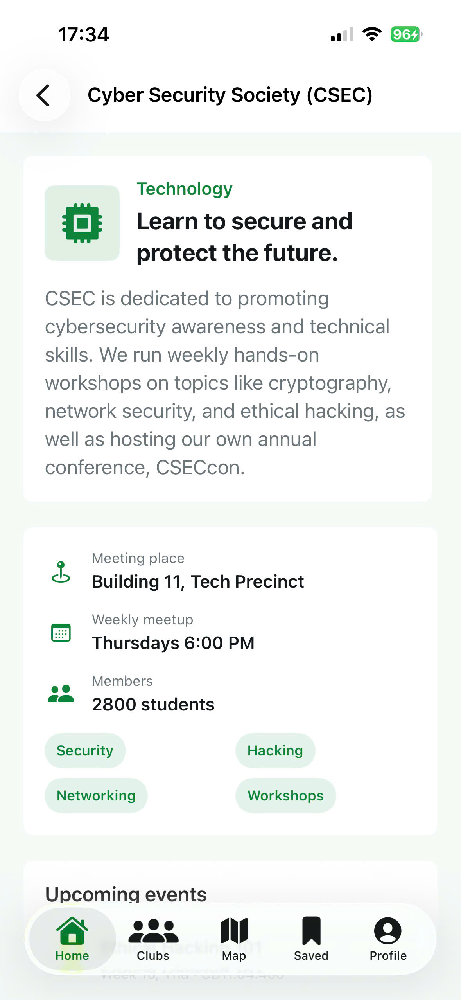
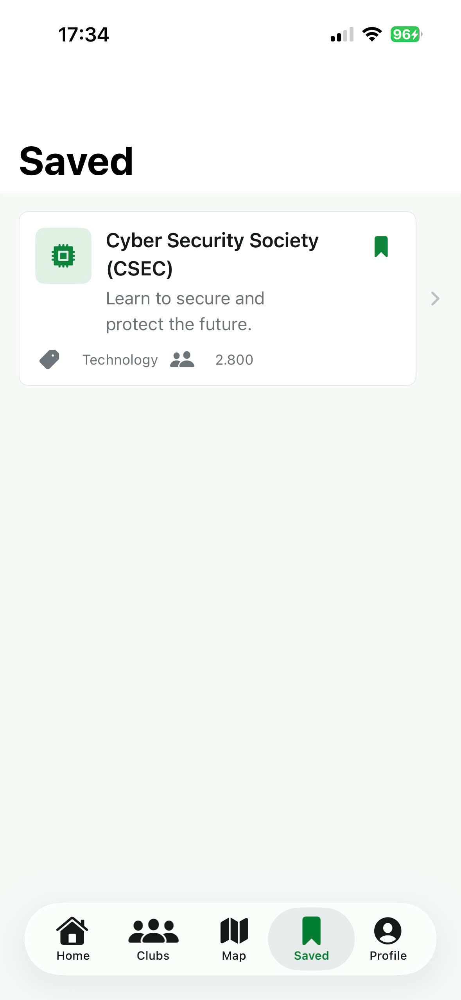
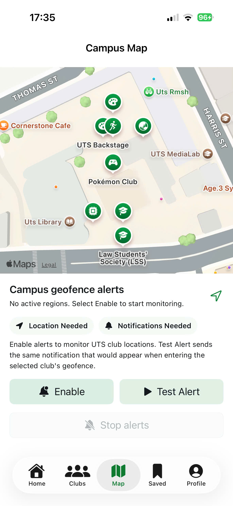
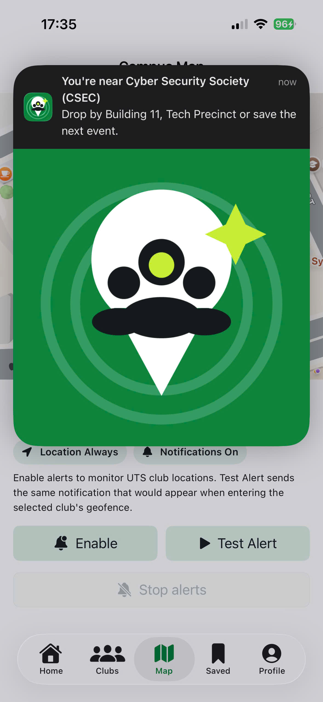
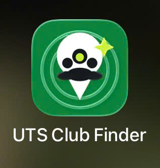

# UTS Club Finder

GitHub repository: https://github.com/tuwang2301/UTSClubFinder

UTS Club Finder is a SwiftUI iOS application that helps UTS students discover clubs, compare events, save clubs, view club locations on campus, and receive location-aware club alerts.

## Group Members:
26139333 - Quang Tu Nguyen
25213481 - Sarthak Verma
25150653 - Thailong Chrin
25628367 - Leah Kim

## Target Audience

The target audience is UTS students, especially first-year, international, and socially new students who want to find communities on campus but do not know where club information is published.

## Problem Being Solved

Club information is often spread across posters, social media pages, word of mouth, ActivateUTS pages, and event stalls. This makes it difficult for students to compare clubs, remember events, and know where clubs are located on campus.

UTS Club Finder solves this by centralising:

- club discovery
- category filtering and searching
- club detail pages
- upcoming events
- saved clubs
- campus map pins
- geofence-style club alerts
- direct club contact links

## Comparison With Other Solutions

Compared with posters, Instagram pages, and manual browsing on club websites, this app provides a more structured mobile experience:

- Posters are easy to miss; this app keeps club information searchable.
- Social media pages are fragmented; this app groups clubs by category.
- Websites usually require manual browsing; this app gives students a saved shortlist.
- Static lists do not support location awareness; this app demonstrates CoreLocation geofencing and notification alerts.

## Key Features

- Browse featured clubs from the Home screen.
- Search and filter clubs by category.
- View detailed club information, events, member count, meeting place, and social links.
- Save favourite clubs.
- Register interest with validation for name, UTS student email, and study area.
- View club locations using MapKit.
- Enable location-aware club alerts using CoreLocation.
- Test geofence notifications during presentation using a controlled Test Alert button.
- Custom app icon and notification logo.

## iOS Frameworks And Services Used

- `SwiftUI`: user interface, tabs, navigation, lists, forms, reusable components.
- `MapKit`: campus map and club markers.
- `CoreLocation`: location permission and geofence monitoring with `CLCircularRegion`.
- `UserNotifications`: local notification alerts and foreground notification presentation.
- `XCTest`: unit tests for repository behaviour and search filtering.
- `UIKit`: navigation/tab bar appearance tuning and haptic feedback in the register-interest flow.

## Product Design Cycle

The app was developed through an iterative product design cycle:

1. Prototype: the team started from an HTML prototype for a UTS club discovery app.
2. MVP build: the prototype was converted into a native SwiftUI app with tabs, club data, search, save, detail, and map screens.
3. Framework integration: MapKit, CoreLocation, and UserNotifications were added to solve the location-aware discovery problem.
4. User testing: testing on simulator and physical iPhone revealed issues with simulator lag, foreground notifications, navigation title contrast, and app icon caching.
5. Refinement: the team fixed notification foreground presentation, added a Test Alert flow for presentation, improved navigation colours, added custom empty states, and added app/notification branding.

## Greatest Technical Difficulty

The most difficult part was geofencing and notification behaviour. CoreLocation requires permission handling, device support checks, and region monitoring. UserNotifications also behaves differently when the app is in the foreground, so the app implements `UNUserNotificationCenterDelegate` to show banner notifications during testing.

The final solution separates this logic into:

- `GeofenceManager`: location permission, geofence region setup, stop monitoring, and test entry simulation.
- `NotificationService`: notification permission, notification scheduling, foreground banner presentation, and logo attachment.

This separation keeps the Map screen focused on UI while services handle framework-specific behaviour.

## Code Design And Rubric Evidence

### Data Modeling

`Club`, `ClubCategory`, and `ClubEvent` model the problem domain directly. Clubs include category, description, tags, meeting place, coordinates, geofence radius, upcoming events, member count, and social links.

### Immutable Data And Idempotent Methods

Most model fields use `let`, making app data immutable after creation. `ClubRepository.setFavourite(_:for:)` is idempotent, so repeatedly setting the same saved state gives the same result.

### Functional Separation

The codebase is separated by responsibility:

- `Models`: app data structures.
- `Data`: sample club content.
- `Services`: repository, geofencing, notifications.
- `ViewModels`: search/filter state.
- `Views`: SwiftUI screens and reusable UI components.

### Loose Coupling

Views communicate with services through `EnvironmentObject` dependencies. For example, `CampusMapView` uses `GeofenceManager` and `NotificationService` without owning their internal framework logic.

### Extensibility

New clubs can be added by editing `SampleClubs.all`. New categories can be added through `ClubCategory`. New screens can be added to `AppRootView` without changing the service layer.

### Error Handling

The app handles:

- invalid registration names
- invalid UTS student email addresses
- missing study area input
- empty search results
- no saved clubs
- denied or unavailable location permission
- unavailable geofence support
- foreground notification presentation

### Collaborative Work

The repository uses GitHub branches, commits, and Pull Requests. `TASK_SPLIT.md` defines screen ownership and planned responsibilities for four members.

## Geofencing Demo

The Map tab demonstrates `MapKit`, `CoreLocation`, and `UserNotifications`.

Demo steps:

1. Open the app in Xcode.
2. Go to the Map tab.
3. Select a club marker to show the selected club preview.
4. Tap Enable to request notification and location permission.
5. Tap Test Alert to send the same notification that would appear when entering the selected club's geofence.
6. Tap Stop alerts to stop monitoring active club regions.

Presentation note: the Test Alert button is included because physically walking into a campus geofence is not practical during a five-minute lab presentation. The production path is still represented by `GeofenceManager`, which uses `CLLocationManager` and `CLCircularRegion`.

## App Screenshots

The following screenshots were captured from a physical iPhone.

| Home | Clubs |
| --- | --- |
|  |  |

| Club Detail | Saved |
| --- | --- |
|  |  |

| Map And Geofence Controls | Notification Alert |
| --- | --- |
|  |  |

| App Icon |
| --- |
|  |

## How To Open

Recommended Xcode setup:

1. Clone the repository on a Mac.
2. Double-click `UTSClubFinder.xcodeproj`.
3. Select an iPhone simulator or physical iPhone.
4. Press Run in Xcode.

Clone command:

```bash
git clone https://github.com/tuwang2301/UTSClubFinder.git
cd UTSClubFinder
open UTSClubFinder.xcodeproj
```

If Xcode asks for signing, select the `UTSClubFinder` app target, open Signing & Capabilities, then choose an Apple Developer team or personal team.

## Team Collaboration Notes

This section is included as evidence for the group-work rubric. The repository history should show each teammate contributing through small commits or branches/PRs for separate screens and services.

For day-to-day group work, keep `main` stable, test in Xcode before merging, and include screenshots when a UI change is made. Detailed screen ownership and branch suggestions are kept in `TASK_SPLIT.md` so the submission README stays focused on the product and rubric.

## Supporting Files

- `TASK_SPLIT.md`: team planning and collaboration evidence; not required to run the app.
- `PRESENTATION_OUTLINE.md`: five-minute presentation structure.
- `RUBRIC_NOTES.md`: code-design rubric notes.
